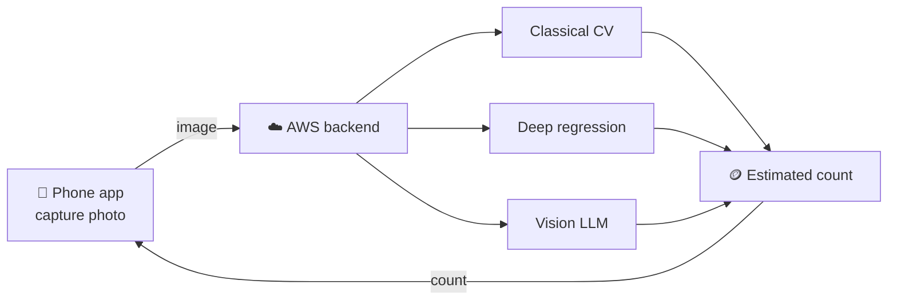

<div align="center">

# 🪙 CoinCounter

**How many coins are in this photo?**

Three ways to answer it — classical computer vision, a deep regression model, and a
vision-capable LLM — compared on accuracy, latency, and cost, then served to a mobile app.

[](LICENSE)
[](https://www.python.org/)
[](#roadmap)
[](#dataset)

</div>

---

## Overview



| Approach | Idea | Trades |
|---|---|---|
| **Classical CV** | Hough circles / blob detection | Fast and free; brittle to lighting and overlap |
| **Deep regression** | CNN trained to predict a count | Accurate on in-domain photos; needs training data |
| **Vision LLM** | Ask a multimodal model directly | Zero training; higher latency and per-call cost |

## Dataset

117 phone photos of coins on a flat surface, each labeled with the number of coins visible.

| Split | Images | Coin counts |
|:--|--:|:--|
| `train` | 82 | 1–12 |
| `val` | 19 | 1–12 |
| `test` | 16 | 1–12 |
| **Total** | **117** | **764 coins** |

```text
dataset/
├── images/       # 117 JPEGs, 480×480
├── labels.json   # { "IMG_4315.jpg": 7, ... }
├── train/        # images/ + labels.json
├── val/
└── test/
```

Labels are a single integer per image — the coin count, nothing else. The 70/15/15 split is
stratified by count (seed `42`), so every count appears in all three splits, and each split
carries its own `labels.json` in the same `{filename: count}` shape.

> **Note**
> Images were resized to an exact 480×480, a stretch rather than a center crop, so the original
> aspect ratio is not preserved.

```python
import json
from pathlib import Path

split = Path("dataset/train")
labels = json.loads((split / "labels.json").read_text())
for name, count in labels.items():
    image_path = split / "images" / name   # 480×480 JPEG
```

## Repository layout

| Path | What it is |
|---|---|
| `dataset/` | Images, labels, and the train/val/test splits |
| `archive/tools/` | One-off scripts that built the dataset — conversion, labeling UI, splitting |

## Roadmap

- [x] Collect and label the photo dataset
- [ ] Benchmark the three counting approaches on `test`
- [ ] Serve the best model from an AWS backend
- [ ] Ship the mobile capture app

## License

[Apache 2.0](LICENSE)
