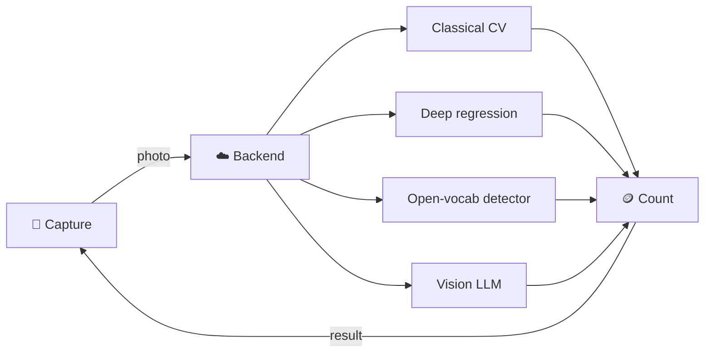

<div align="center">

<h1>🪙 CoinCounter</h1>

**How many coins are in this photo?**

Four ways to answer it — classical computer vision, deep regression, zero-shot open-vocabulary
detection, and a vision LLM —
benchmarked on one labeled dataset and exposed through a reusable Python package.
The server and iPhone app will live in separate repositories.

<a href="LICENSE"></a>

<a href="#dataset"></a>
<a href="#roadmap"></a>

<br><br>


<sub>Samples from the dataset — the badge is the label.</sub>

</div>

---

The dataset, reusable Python package, and benchmark workflow are implemented with a
`random_guess` baseline, an OpenCV `hough` engine, a ResNet-18 `regression` engine trained
on this laptop-sized dataset, and a zero-shot `grounding_dino` open-vocabulary detector.
The vision-LLM engine remains an explicit placeholder; Plotly visualization is future work.

```bash
pip install -e '.[hough,regression,grounding-dino]'
python -m benchmark.train_regression --dataset dataset --out models/regression   # ~90 s on an M4
python -m benchmark.compute --dataset dataset --split test --engine grounding_dino regression hough random_guess
```

Benchmark commands also work directly from the repository when Pillow and NumPy are
installed (plus OpenCV for Hough). Configuration files currently use the JSON subset of YAML.

<details open>
<summary><b>How it works and repository boundaries</b></summary>

This repository owns the Python package, counting engines, dataset, and benchmarks.
The CoinCounter server repository will depend on a versioned package release and own
Docker deployment and HTTP endpoints such as `/health_check` and `/count`. The iPhone
app repository will own camera capture and communication with that server.



| Approach | Method | Trade-off |
|---|---|---|
| **Classical CV** | Hough circles / blob detection | Fast and free — brittle to lighting and overlap |
| **Deep regression** | CNN trained to predict a count | Accurate in-domain — needs training data |
| **Open-vocabulary detection** | Grounding DINO prompted with "coin." | No training, boxes for free — 660 MB model, ~0.5 s per image |
| **Vision LLM** | Ask a multimodal model directly | No training — higher latency and cost per call |

The point of the project is the comparison: same images, same metric, four very different
cost and accuracy profiles.

</details>

<a id="dataset"></a>
<details open>
<summary><b>Dataset</b></summary>

117 phone photos of coins on a flat surface. Each image is a 480×480 JPEG labeled with a
single integer — the number of coins visible.

<div align="center">
<picture>
  <source media="(prefers-color-scheme: dark)" srcset="assets/distribution-dark.svg">
  
</picture>
</div>

| Split | Images | Share |
|:--|--:|--:|
| `train` | 82 | 70% |
| `val` | 19 | 16% |
| `test` | 16 | 14% |
| **Total** | **117** | **764 coins** |

```text
dataset/
├── images/       # all 117 JPEGs, 480×480
├── labels.json   # { "IMG_4315.jpg": 7, ... }
├── train/        # images/ + its own labels.json
├── val/
└── test/
```

```python
import json
from pathlib import Path

split = Path("dataset/train")
labels = json.loads((split / "labels.json").read_text())

for name, count in labels.items():
    image_path = split / "images" / name   # 480×480 JPEG, `count` coins
```

The 70/15/15 split is stratified by coin count (seed `42`), so all counts 1–12 appear in every
split, and each split carries its own `labels.json` in the same `{filename: count}` shape.

> [!NOTE]
> Images were resized to an exact 480×480 — a stretch, not a center crop — so the original
> aspect ratio is not preserved. Labels record the count only: no denomination or position.

</details>

<details open>
<summary><b>Repository structure</b></summary>

```text
CoinCounter/
├── pyproject.toml                 # Packaging, optional dependencies, CLI
├── README.md
├── LICENSE
├── .gitignore
├── src/
│   └── coincounter/
│       ├── __init__.py            # Public CoinCounter and CountResult exports
│       ├── counter.py            # Initialize an engine once; reuse for frames
│       ├── types.py              # Shared result and detection types
│       ├── exceptions.py         # Predictable public errors
│       ├── image.py              # Image loading and RGB normalization
│       ├── engines/
│       │   ├── __init__.py
│       │   ├── base.py           # Abstract run/close interface
│       │   ├── registry.py       # Engine lookup and lazy imports
│       │   ├── random_guess.py   # Implemented training-prior baseline
│       │   ├── hough.py
│       │   ├── regression.py     # ResNet-18 count regression, output bounded to [0, 20]
│       │   ├── grounding_dino.py # Zero-shot detector; count = boxes above threshold
│       │   └── vision_llm.py
│       └── cli/
│           ├── __init__.py
│           └── count.py          # Single-image count command
├── benchmark/
│   ├── __init__.py
│   ├── compute.py                # Run, cache, measure, and print comparison
│   ├── vis.py                    # Read-only browser for saved predictions
│   ├── tune_hough.py             # Training shortlist and validation selection
│   ├── train_regression.py       # Fine-tune ResNet-18 on train, select on val
│   ├── dataset.py                # Images, labels, and split selection
│   ├── cache.py                  # Cache identity and validation
│   ├── results.py                # Prediction files and JSON/CSV summaries
│   ├── metrics.py                # Accuracy, error, timing, and cost
│   └── reporting.py              # ASCII tables; Plotly plots later
├── configs/
│   └── benchmark/
│       ├── default.yaml          # Explicit default engine list
│       ├── random_guess.yaml     # Baseline seed; prior derived from train
│       ├── hough.yaml
│       ├── regression.yaml
│       ├── grounding_dino.yaml
│       └── vision_llm.yaml
├── dataset/                      # Existing images, labels, train/val/test
├── models/
│   ├── README.md                 # Weight sources, versions, checksums
│   └── regression/training.json  # Versioned training log; weights are ignored by Git
├── results/                      # Generated predictions; ignored by Git
├── reports/                      # Generated summaries and plots
├── examples/
│   ├── count_image.py
│   └── count_frames.py
├── tests/
│   ├── test_counter.py
│   ├── test_image.py
│   ├── test_engine_contract.py
│   ├── test_cli.py
│   ├── engines/
│   └── benchmark/
├── docs/
│   ├── python-api.md
│   ├── adding-an-engine.md
│   ├── benchmarking.md
│   └── server-integration.md
├── .github/workflows/            # CI and versioned package releases
├── assets/                       # Existing README visuals
└── archive/tools/                # Existing dataset preparation scripts
```

Only `src/coincounter/` ships as runtime code in the installed package. Dataset images,
benchmark tooling, reports, and model weights are excluded from the distribution.
`compute.py` is the benchmark entry point; separate `analyse.py` and `pareto.py` scripts
are not needed. Calculations belong in `metrics.py`, presentation in `reporting.py`.

</details>

<details open>
<summary><b>Python API and engine interface</b></summary>

```python
from coincounter import CoinCounter

counter = CoinCounter(
    engine="random_guess",
    parameters={
        "counts": list(range(1, 13)),
        "weights": [6, 6, 8, 8, 9, 8, 7, 6, 5, 5, 1, 13],
        "seed": 42,
    },
)

try:
    for frame in frames:
        result = counter.run(frame)
        print(result.count)
finally:
    counter.close()
```

`CoinCounter` accepts image paths or decoded RGB frames. Initialization loads the chosen
engine and any model once; subsequent `run(image)` calls reuse it. Engines are importable
modules implementing a common abstract interface, rather than standalone subprocesses.
Both the counter and engines provide `run()` and `close()`; the counter also supports
context-manager cleanup.

| Result field | Contract |
|---|---|
| `count` | Required nonnegative integer |
| `confidence` | Optional; `None` when unavailable, not automatically comparable across engines |
| `detections` | Optional positions or boxes when the engine supports them |
| `metadata` | Additional JSON-compatible engine information |

Inference returns a result without printing or writing benchmark files. The CLI owns
terminal output, and benchmark compute owns persistence and timing measurements.

</details>

<details open>
<summary><b>Compute commands and result caching</b></summary>

```bash
# Installed package: one image, stdout contains only the integer count
coincounter count image.jpg --engine random_guess --parameters prior.json

# Benchmark one image and save its prediction
python -m benchmark.compute --image dataset/images/IMG_4315.jpg --engine random_guess

# Run every engine in configs/benchmark/default.yaml on the test split
python -m benchmark.compute --dataset dataset --split test

# Select engines explicitly
python -m benchmark.compute --dataset dataset --split test --engine random_guess

# Run all canonical dataset images once (without traversing split copies)
python -m benchmark.compute --dataset dataset

# Recompute cached predictions
python -m benchmark.compute --dataset dataset --split test --force

# Display fastest engines first
python -m benchmark.compute --dataset dataset --split test --sort time
```

`prior.json` contains the `counts`, `weights`, and `seed` object shown in the Python API.
Benchmark compute derives these frequencies automatically from `dataset/train/labels.json`.
`random_guess`, `hough`, `regression`, and `grounding_dino` are registered; the first two are
enabled by default. `regression` is opt-in because it needs trained weights, and
`grounding_dino` because it downloads a 660 MB checkpoint from Hugging Face on first use. Multiple implemented engines can be supplied after `--engine`; requesting a
placeholder produces a visible error.

Run only Hough with `python -m benchmark.compute --dataset dataset --split test --engine hough`.
For the installed CLI, use `coincounter count image.jpg --engine hough --parameters configs/benchmark/hough.yaml`.

Omitting `--engine` uses an explicit default list, not every discovered engine. This keeps
engines requiring weights, credentials, or paid API calls opt-in through configuration.
Missing requirements and failed engines are reported visibly rather than silently omitted.
Each selected engine is initialized once and reused across images.

Single-image, single-engine runs print only the count to stdout, with diagnostics on stderr.
Dataset runs and multi-engine comparisons print labeled results. `--forece` is accepted
as an alias for `--force`.

```bash
# Browse saved predictions in a local web page; never runs inference
python -m benchmark.vis --dataset dataset --split test --engine hough
python -m benchmark.vis --dataset dataset --engine hough --image dataset/images/IMG_4315.jpg
```

`benchmark.vis` opens a browser page showing each image with its filename, ground-truth
count, saved prediction, error, and recorded inference time. Navigate with Previous/Next
or the arrow keys; browsing stops at the dataset boundaries. Hough shows original →
grayscale → median blur → detected circles, with the overlay drawn from saved detections.
When several configurations exist for an engine, a dropdown selects between them. Missing
predictions or stages are reported as messages, never recomputed. Grayscale and blur
panels are Pillow reconstructions from the manifest parameters, shown for orientation.

```text
results/<engine>/<configuration-id>/
├── manifest.json                 # Parameters, engine version, model identity
└── <dataset-id>/<split>/          # "all" when no split is selected
    ├── IMG_4315.jpg-<hash>.txt     # Integer count only, e.g. 7
    └── IMG_4315.jpg-<hash>.json    # Image hash, timing, result metadata
```

Reuse a successful cached prediction only when image contents, package/benchmark source,
parameters, and recorded environment match. Future model engines must also fingerprint
weights or remote model revisions. Write artifacts atomically and validate the complete
result pair before skipping inference. A failure or interrupted write is not a valid result.
`--force` recomputes predictions even when a valid cache exists.

</details>

<details open>
<summary><b>Metrics, ASCII comparison, and future plots</b></summary>

Compute calculates metrics after inference or cache loading and prints an ASCII table.
Default ordering is exact-count accuracy descending, then mean inference time ascending.
`--sort time` orders by mean inference time ascending.

Measured engine comparison (Python 3.12.3, Linux x86_64, OpenCV 4.7.0).
The random-guess baseline (seed `42`) samples the empirical distribution of the **82 training labels**:

| Coin count | 1 | 2 | 3 | 4 | 5 | 6 | 7 | 8 | 9 | 10 | 11 | 12 |
|---|---|---|---|---|---|---|---|---|---|---|---|---|
| Training images | 6 | 6 | 8 | 8 | 9 | 8 | 7 | 6 | 5 | 5 | 1 | 13 |

The normalized image hash and seed determine a reproducible random draw. The image is
used only as an identity, not as visual evidence, and test labels never determine the prior.
Confidence is unavailable (`None`). These are one-seed baseline measurements, not an
estimate averaged over many random seeds.

Command: `python -m benchmark.compute --dataset dataset --split test --force --engine grounding_dino regression hough random_guess --reports reports/grounding-dino-v1`
(Apple M4, macOS 26.5, Python 3.14.0, PyTorch 2.14.0 on MPS, transformers 5.17.0, OpenCV 4.14.0)

```text
Test split: 16 images

+----------------+--------+----------+-------+---------+-----------+--------+--------+
| Engine         | Scored | Accuracy | MAE   | Mean ms | Total sec | Cached | Failed |
+----------------+--------+----------+-------+---------+-----------+--------+--------+
| grounding_dino | 16/16  | 93.75%   | 0.062 | 576.890 | 9.230239  | 0      | 0      |
| regression     | 16/16  | 56.25%   | 0.438 | 9.770   | 0.156321  | 0      | 0      |
| hough          | 16/16  | 18.75%   | 4.312 | 2.421   | 0.038734  | 0      | 0      |
| random_guess   | 16/16  | 6.25%    | 3.938 | 1.533   | 0.024532  | 0      | 0      |
+----------------+--------+----------+-------+---------+-----------+--------+--------+
```

Grounding DINO gets **15/16 counts exactly right** with a single coin of total absolute
error, without any training on this dataset. The regression engine gets **9/16** (7 coins),
Hough **3/16** (69 coins), and random guess **1/16** (63 coins). The ranking is a clean
accuracy-versus-cost trade: Grounding DINO is about 60× slower than regression, 240× slower
than Hough, and needs 5.9 s of model loading plus a 660 MB download. Timings include image
decoding and depend on the environment; they are not isolated algorithm timings.

The command generates local JSON/CSV summaries under `reports/grounding-dino-v1/<dataset-id>/test/`.
Generated summaries and per-image count files under `results/` are ignored by Git.
The Hough [tuning results](reports/hough-v1/tuning.json) and the regression
[training log](models/regression/training.json) remain versioned.

| Split | grounding_dino | regression | hough | random_guess |
|:--|--:|--:|--:|--:|
| `test` (16, held out) | **93.75% / 0.062** | 56.25% / 0.438 | 18.75% / 4.312 | 6.25% / 3.938 |
| `val` (19, used for selection) | 94.74% / 0.053 | 78.95% / 0.211 | 26.32% / 3.526 | 15.79% / 3.158 |
| all 117 (includes train) | 96.58% / 0.034 | 81.20% / 0.188 | 17.09% / 4.043 | 9.40% / 3.650 |

Cells are exact accuracy / MAE. Only the `test` row is a held-out score. Regression was
trained on `train` and its checkpoint chosen on `val`; the Grounding DINO threshold was
chosen on `train` + `val`; Hough parameters were tuned on `train` and selected on `val`.

- **Accuracy:** Percentage of scored images whose predicted count exactly matches the label.
- **MAE:** Mean absolute count error; lower is better.
- **Mean ms / Total sec:** Average and summed `CoinCounter.run` time, including image
  decoding/normalization and inference, excluding model loading, hashing, and file writes.
- **Scored / Cached:** Prediction coverage and number of reused predictions.

Show failures and incomplete engines separately from the completed ranking. Report model
loading and current command elapsed time separately. Cached timings are labeled as recorded
measurements, not fresh inference time. Record hardware, execution conditions, and timing
scope so comparisons are reproducible; capture API cost and memory use where available.

Save JSON and CSV summaries under `reports/` alongside provenance identifying the inputs
and configurations. Tune on train/validation data and reserve test for final comparisons.

Later, `reporting.py` will use saved summaries for Plotly plots: inference time on the x-axis,
accuracy on the y-axis, with the Pareto set highlighted. A configuration is nondominated
when no other configuration is at least as accurate and at least as fast, with a strict
improvement in one of those metrics. Plotting saved results must not require rerunning engines.

</details>

<details open>
<summary><b>Hough engine and parameter selection</b></summary>

Install `pip install -e '.[hough]'`, then reuse `CoinCounter("hough")` across frames.
The engine converts RGB to grayscale, applies a median filter, and detects circles with
[OpenCV HoughCircles](https://docs.opencv.org/4.x/d4/d70/tutorial_hough_circle.html).
It returns the count and `{x, y, radius}` detections in input-image pixels. Confidence is
`None`; no calibrated confidence score is available. No model weights are needed.

`python -m benchmark.tune_hough` evaluates 24 configurations on a fixed 21-image training
subset, shortlists five by exact-count accuracy then MAE, and selects on all 19 validation
images. Test images and labels are not used during tuning. The selected configuration
scored **26.32% accuracy / 3.526 MAE on validation** and **14.63% / 4.110 on full train**.
An initial training-only sweep with permissive thresholds was stopped because of excessive
false circles; the saved tuning report describes the final grid.

| Parameter | Selected value |
|---|---:|
| `dp` | 1.0 |
| `min_distance` | 24 px |
| `min_radius` / `max_radius` | 10 / 30 px |
| `edge_threshold` | 200 |
| `accumulator_threshold` | 30 |
| `blur_size` | 5 |

The same defaults are in the engine and `configs/benchmark/hough.yaml`. Radius limits,
edge thresholds, and accumulator thresholds were searched; spacing, dp, and blur were
fixed. These pixel-scale settings target the 480×480 dataset and may need adjustment for
other resolutions. Patterned surfaces, noncircular projections, and overlapping coins
remain limitations. See [benchmarking notes](docs/benchmarking.md) for reproducibility.

</details>

<details open>
<summary><b>Regression engine and training</b></summary>

Install `pip install -e '.[regression]'` (PyTorch and torchvision). The engine is a
torchvision ResNet-18 initialised from ImageNet weights with its classifier replaced by a
single output; the count is `max_count * sigmoid(output)`, so predictions are bounded to
**0–20** by construction and rounded to the nearest integer. Input is resized to
320×320 and ImageNet-normalised. Confidence is `None`; `metadata.raw_count` carries the
unrounded prediction.

```bash
python -m benchmark.train_regression --dataset dataset --out models/regression
```

Training fine-tunes every layer on the 82 training images for 60 epochs with AdamW,
one-cycle learning rate (peak 3e-4), Smooth-L1 loss, and flip / 90° rotation / colour-jitter
augmentation. Each epoch is scored on the 19 validation images and the checkpoint with the
best exact-count accuracy (then MAE) is kept. Test images are never read. The run takes
about 90 s on an Apple M4 and writes `models/regression/resnet18-320.pt` (45 MB, ignored by
Git) plus a versioned `training.json` with the full epoch history.

| Input size | Val accuracy | Val MAE | Train time (M4) |
|---:|---:|---:|---:|
| 224 | 47.4% | 0.947 | 40 s |
| **320** | **78.9%** | **0.211** | 92 s |
| 448 | 68.4% | 0.368 | 168 s |

Coins are 20–60 px across at 480×480, so 224 px input loses detail; 320 px was selected on
validation. With 82 training images the model is data-limited and single-seed; expect
run-to-run variance and a drop on new backgrounds or lighting. The benchmark manifest
records the weights' SHA-256, so retrained weights never reuse a stale cache. See
[models/README.md](models/README.md) for the checksum of the reported weights.

</details>

<details open>
<summary><b>Grounding DINO engine (zero-shot detection)</b></summary>

Install `pip install -e '.[grounding-dino]'` (PyTorch and Hugging Face transformers). The
engine runs [Grounding DINO](https://huggingface.co/IDEA-Research/grounding-dino-tiny), an
open-vocabulary detector, with the text prompt `"coin."` and counts the boxes whose score
clears `box_threshold`. No training or dataset-specific weights are involved. Detections
are `{x1, y1, x2, y2, score}` boxes in input-image pixels, so the
[results viewer](#compute-commands-and-result-caching) draws them directly. Confidence is
`None`; per-box scores are in `detections`.

```python
from coincounter import CoinCounter

with CoinCounter("grounding_dino") as counter:          # downloads ~660 MB on first use
    result = counter.run("dataset/images/IMG_4315.jpg")
    print(result.count, result.detections[0])
```

| Parameter | Default | Note |
|---|---|---|
| `model` | `IDEA-Research/grounding-dino-tiny` | Any Grounding DINO checkpoint id or local path |
| `prompt` | `"coin."` | Lower-cased; a trailing period is added if missing |
| `box_threshold` | `0.4` | Selected on `train` + `val` (98/101 exact) |
| `text_threshold` | `0.25` | Token-to-phrase threshold; not sensitive here |
| `device` | `"auto"` | MPS, then CUDA, then CPU |
| `revision` | `None` | Pin a Hugging Face commit for reproducibility |

Real coins score 0.6–0.8 and background clutter scores below 0.2, so exact accuracy is flat
from `box_threshold` 0.30 to 0.45 on both `train` and `val`. The benchmark manifest records
the resolved model commit hash and transformers version, so a checkpoint update invalidates
the cache. Known limitations: ~0.5 s per image on an M4 (far slower than the other
engines), a 660 MB download, and one over-count on `test` from a spurious box scoring
exactly 0.40, right at the threshold.

</details>

<details open>
<summary><b>Integration with the separate server repository (planned)</b></summary>

- Publish a versioned Python package; the server pins its dependency to a release.
- Provide optional engine dependencies such as `coincounter[hough]`,
  `coincounter[regression]`, `coincounter[grounding-dino]`, and `coincounter[vision-llm]`,
  with lazy engine imports.
- Accept explicit model paths and device settings. Avoid unexpected model downloads
  during the first inference request.
- Load a counter at server startup and close it at shutdown. Each worker owns its model
  instance, so worker count affects memory consumption.
- Treat instances as non-thread-safe unless an engine documents otherwise; the server
  serializes access or manages separate instances.
- Expose predictable invalid-image, unavailable-engine, model-loading, and inference errors
  for the server to map to HTTP responses.
- Keep credentials in environment variables or injected configuration, never committed files.

Docker, HTTP routing, request validation, and iPhone code belong in their respective
repositories and are not dependencies of this package.

</details>

<details open>
<summary><b>Rebuilding the dataset from raw photos</b></summary>

<br>

```bash
# 1. HEIC → 480×480 JPEG (macOS sips, no dependencies)
archive/tools/convert_images.sh /path/to/raw/photos dataset/images

# 2. Label in the browser — one image at a time, autosaves, resumable
python3 archive/tools/label_tool.py

# 3. Regenerate the splits
python3 archive/tools/split_dataset.py --ratios 0.7 0.15 0.15 --seed 42
```

`make_readme_assets.py` regenerates the sample grid and the chart above (requires Pillow).

</details>

<a id="roadmap"></a>
<details open>
<summary><b>Roadmap</b></summary>

- [x] Collect and label the photo dataset
- [x] Build the installable package and reusable `CoinCounter` API
- [x] Implement the common engine interface and random-guess baseline
- [x] Implement and evaluate the Hough engine
- [x] Implement and evaluate the regression engine
- [x] Implement and evaluate the Grounding DINO zero-shot detector
- [ ] Implement the vision-LLM engine
- [x] Add compute with default engines, caching, and `--force`
- [x] Print ASCII accuracy/time comparisons and save JSON/CSV summaries
- [x] Browse saved predictions and Hough stages in a read-only viewer
- [x] Evaluate the random-guess baseline on `test`
- [x] Benchmark random guess, Hough, regression, and Grounding DINO on `test`
- [ ] Add Plotly comparisons and Pareto-set visualization
- [ ] Publish versioned releases for the separate server repository
- [ ] Build the Docker server and iPhone app in their own repositories

</details>

<details open>
<summary><b>License</b></summary>

[Apache 2.0](LICENSE) © CoinCounter contributors

</details>
