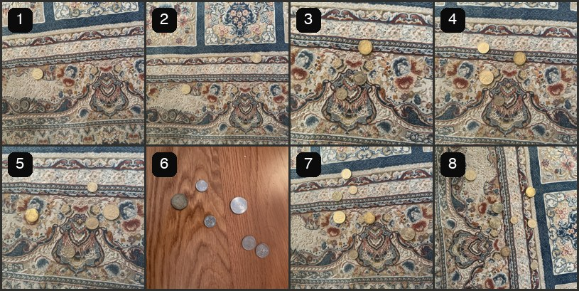
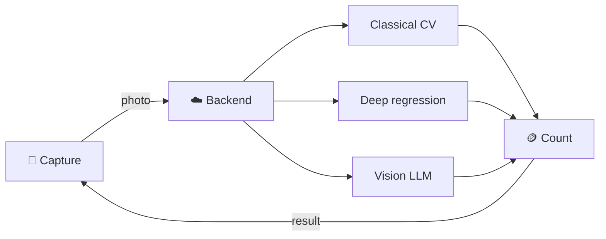
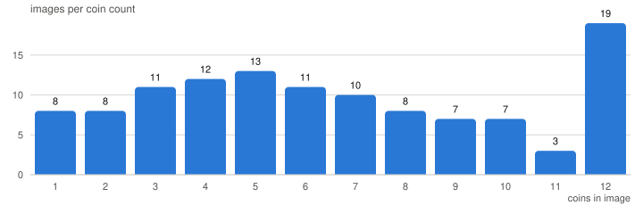

<div align="center">

<h1>🪙 CoinCounter</h1>

**How many coins are in this photo?**

Three ways to answer it — classical computer vision, deep regression, and a vision LLM —
benchmarked on one labeled dataset, then served to a mobile app.

<a href="LICENSE"></a>

<a href="#dataset"></a>
<a href="#roadmap"></a>

<br><br>



<sub>Samples from the dataset — the badge is the label.</sub>

</div>

---

## How it works



| Approach | Method | Trade-off |
|---|---|---|
| **Classical CV** | Hough circles / blob detection | Fast and free — brittle to lighting and overlap |
| **Deep regression** | CNN trained to predict a count | Accurate in-domain — needs training data |
| **Vision LLM** | Ask a multimodal model directly | No training — higher latency and cost per call |

The point of the project is the comparison: same images, same metric, three very different
cost and accuracy profiles.

## Dataset

117 phone photos of coins on a flat surface. Each image is a 480×480 JPEG labeled with a
single integer — the number of coins visible.

<div align="center">
<picture>
  <source media="(prefers-color-scheme: dark)" srcset="assets/distribution-dark.svg">
  
</picture>
</div>

| Split | Images | Share |
|:--|--:|--:|
| `train` | 82 | 70% |
| `val` | 19 | 16% |
| `test` | 16 | 14% |
| **Total** | **117** | **764 coins** |

```text
dataset/
├── images/       # all 117 JPEGs, 480×480
├── labels.json   # { "IMG_4315.jpg": 7, ... }
├── train/        # images/ + its own labels.json
├── val/
└── test/
```

```python
import json
from pathlib import Path

split = Path("dataset/train")
labels = json.loads((split / "labels.json").read_text())

for name, count in labels.items():
    image_path = split / "images" / name   # 480×480 JPEG, `count` coins
```

The 70/15/15 split is stratified by coin count (seed `42`), so all counts 1–12 appear in every
split, and each split carries its own `labels.json` in the same `{filename: count}` shape.

> [!NOTE]
> Images were resized to an exact 480×480 — a stretch, not a center crop — so the original
> aspect ratio is not preserved. Labels record the count only: no denomination or position.

## Repository layout

| Path | Contents |
|---|---|
| `dataset/` | Images, labels, and the train/val/test splits |
| `assets/` | README visuals |
| `archive/tools/` | One-off scripts that built the dataset — HEIC conversion, labeling UI, splitting |

<details>
<summary><b>Rebuilding the dataset from raw photos</b></summary>

<br>

```bash
# 1. HEIC → 480×480 JPEG (macOS sips, no dependencies)
archive/tools/convert_images.sh /path/to/raw/photos dataset/images

# 2. Label in the browser — one image at a time, autosaves, resumable
python3 archive/tools/label_tool.py

# 3. Regenerate the splits
python3 archive/tools/split_dataset.py --ratios 0.7 0.15 0.15 --seed 42
```

`make_readme_assets.py` regenerates the sample grid and the chart above (requires Pillow).

</details>

## Roadmap

- [x] Collect and label the photo dataset
- [ ] Benchmark the three approaches on `test`
- [ ] Serve the winning model from an AWS backend
- [ ] Ship the mobile capture app

## License

[Apache 2.0](LICENSE) © CoinCounter contributors
